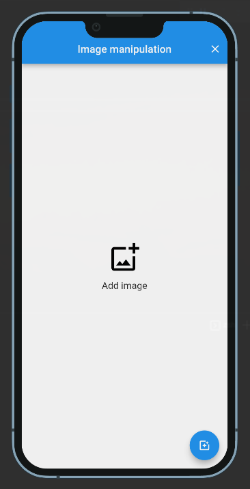
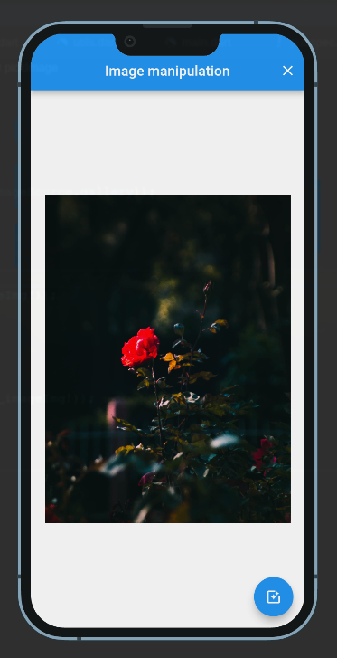
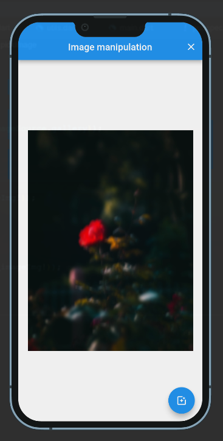

# Image manipulation

This repo shows how to manipulate images in Flutter using [Image package](https://pub.dev/packages/image).
In order to manipulate pixel by pixel, _naiveBlur()_ function is created. 

## Installation

- Check if you are in the stable channel of flutter SDK and the version v2.14.0 or higher. [Instruction to change flutter channel](https://github.com/flutter/flutter/wiki/Flutter-build-release-channels#how-to-change-channels).
- Clone the repo
  ```sh
  git clone https://github.com/oscarnar/image_manipulation.git
  ```
- And then we can use the normal build and run procedure
  ```sh
  flutter pub get
  flutter run
  ```

## Screenshots
<p>



</p>

## Getting Started

This project is a starting point for a Flutter application.

A few resources to get you started if this is your first Flutter project:

- [Lab: Write your first Flutter app](https://flutter.dev/docs/get-started/codelab)
- [Cookbook: Useful Flutter samples](https://flutter.dev/docs/cookbook)

For help getting started with Flutter, view our
[online documentation](https://flutter.dev/docs), which offers tutorials,
samples, guidance on mobile development, and a full API reference.
